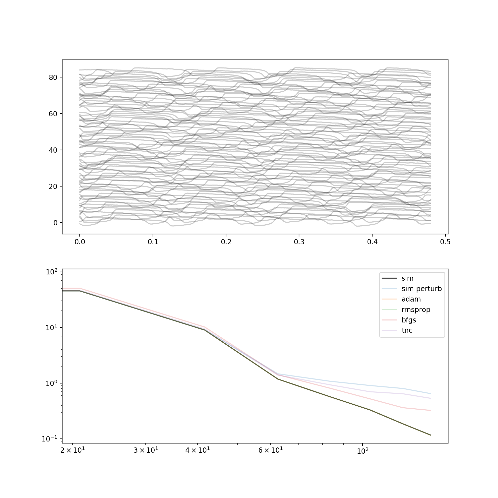

# TVB spectral fitting

This compares the autograd and jax packages for spectral fitting
of a TVB (github.com/the-virtual-brain) model with EEG data,



time series (top) and fitted spectra (bottom).

On a i7-4770HQ 4-core @ 2.2 GHz,

```bash
$ python3 ag.py 
ll truth 13.601
    adam: ll 22.866 .......... 13.812, 101 feval, 37.375s, 11.156 evals/rll
 rmsprop: ll 22.866 .......... 11.462, 101 feval, 34.915s, 8.857 evals/rll
    bfgs: ll 22.866 ........................ 12.020, 240 feval, 59.305s, 22.127 evals/rll
     tnc: ll 22.866 .................... 21.522, 206 feval, 50.450s, 153.291 evals/rll
```
which puts the stochastic gradient techniques well ahead of
traditional optimizers from scipy.optimize.  Using Jax,
```bash
python3 jx.py 
/home/duke/.local/lib/python3.8/site-packages/jax/lib/xla_bridge.py:130: UserWarning: No GPU/TPU found, falling back to CPU.
  warnings.warn('No GPU/TPU found, falling back to CPU.')

```
<h6>well it didn't finish, not sure why </h6>